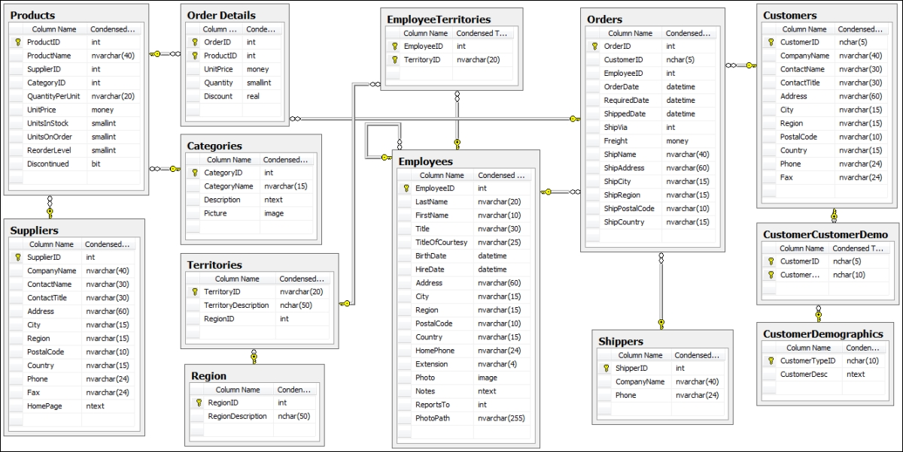

# Northwind-DataWarehouse
- A data warehouse is designed and implemented on the **"Northwind"** database.  
- The Northwind database contains the sales data for a fictitious company called “Northwind Traders” which imports and exports specialty foods from around the world.

## Project Steps
- **Business Requirement**   Nourhan
- **Data Profiling**  
   - Conducted in-depth data profiling of the "Northwind" database to identify data quality issues and anomalies.  
   - Documented and addressed missing values, data types, unique values, and data patterns within the dataset.  

   

- **Data Warehouse Design &Data Modeling**   
   - Employed denormalization techniques to enhance query performance and reduce the need for complex joins.
   - Designed and implemented a dimensional modelling for efficient data warehousing.
 
     
- **Index**   
   -IX_orders_order_id_Unitprice on orders_fact: This index is created on the orders_fact table with columns order_id and Unitprice. It's used to optimize queries that involve filtering, sorting, or joining based on order_id and Unitprice.

   -***country_customer_dim*** on customer_dim: This index is created on the customer_dim table using a hash index structure on the country column. It 's used to speed up queries that filter or group by country in the customer_dim table.

   -****city_customer_dim**** on customer_dim: Similar to the previous index, this one is created on the customer_dim table using a hash index structure on the city column. It 's used to optimize queries involving filtering or grouping by city in the customer_dim table.

   -***category_nameproducts_dim*** on products_dim: This index is created on the products_dim table using a hash index structure on the category_name column. It's used to speed up queries involving filtering or grouping by category_name in the products_dim table.

   -***cust_sur_orders_fact*** on orders_fact: Similar to the previous index, this one is created on the orders_fact table with the cust_sur column. It could 's to optimize queries that involve  joiningbased on cust_sur.

   -***emp_sur_orders_fact*** on orders_fact: This index is created on the orders_fact table with the emp_sur column. It 's used to optimize queries that  join based on emp_sur.

   -***shipper_sur_orders_fact*** on orders_fact: This index is created on the orders_fact table with the shipper_sur column. It 's used to optimize queries that  join based on shipper_sur.

   -***supplier_sur_orders_fact*** on orders_fact: This index is created on the orders_fact table with the supplier_sur column. It 's used to optimize queries that join based on supplier_sur.

- **ETL Data Pipelines**  
   - Developed ETL data pipelines using SQL Server Integration Services **(SSIS)** to automate the extraction, transformation, and loading of data from the source database (OLTP) to the data warehouse (OLAP).
   
        

   - **Control Flow:**
               A package in SSIS consists of a control flow and, optionally, one or more data flows.
               The control flow orchestrates the execution of tasks and containers within the package.
   - **Data Flow**:
               The Data Flow task encapsulates the data flow engine in SSIS.
               When you add a Data Flow task to the package control flow, it enables the package to:
               Extract data from sources.
               Transform, clean, and modify data.
               Load data into destinations (e.g., databases, files, or other systems). 
   - Here is some samples for data flows for our dimensions loading from two different sources at following steps 
   **Data Sources**:
               Begin by adding the necessary data sources to your SSIS package. These sources could be files, relational databases, or even Analysis Services databases.
               Set up connection managers to establish connections to these sources.
   **Transformations**:
               Transformations modify, summarize, and clean data within the data flow.
               using transformations functions:
               Lookup: To enrich data by matching it with lookup tables.
               Derived Column: For creating calculated columns based on existing ones.
               Conditional Split: To route data based on conditions.
               Sort: Arrange data in a specific order.
               Integration:
               Use the Union All transformation to merge data from both sources into a single flow.
               Map the output of the Union All transformation to your destination (e.g., a SQL Server table).
        

   - The important part was loading the data into the **Fact Table** and that was done by collecting all the IDs from tables in the source database using a Merge Join transformation.
   - Then, use a Lookup transformation to get the surrogate key for each dimension and apply any necessary transformations required.
     
     

Q1 : Who are the top and bottom performing sales employees in each country based on their total sales?

The business Need :

This data can help in identifying high performers who may deserve recognition or additional incentives, as well as employees who may need further support or training , and identifying top and bottom performers provides benchmarks for setting realistic sales targets and goals for employees in each country.

And from another aspect that can be a strong base for analyzing sales performance by country allows businesses to allocate resources such as marketing budgets, sales support, and inventory strategically. High-performing countries may warrant increased investment to further capitalize on opportunities, while underperforming regions may require additional support or adjustments to improve results.

 Q2 : Who is the supplier whose products represent the highest and lowest sales, and what are their respective sales figures?

The business Need :

Analyzing supplier sales performance is essential for optimizing sourcing strategies, managing costs, mitigating risks, and fostering mutually beneficial relationships with suppliers , through Knowing which suppliers generate the highest and lowest sales enables businesses to make informed strategic sourcing decisions. They can prioritize relationships with top-performing suppliers, potentially negotiating better terms, volume discounts, or other favorable arrangements. Conversely, businesses can reevaluate or renegotiate contracts with underperforming suppliers or explore alternative sourcing options to mitigate risks and ensure continuity of supply.

Q3 : How can we categorize our customers based on their purchasing behavior ?

The business Need :

The categories derived from this query, such as "At Risk", "Customers Needing Attention", "Promising", "Potential Loyalists", and "Loyal Customers", reflect different stages of the customer lifecycle and provide a framework for understanding and addressing the needs of each customer group effectively.

The categorized groups can help prioritize resources, identify opportunities for upselling or cross-selling, and implement targeted marketing or service strategies.

Q4 : How does the monthly sales performance change over time, and what is the growth rate of sales from one month to the next?

The business Need :

Monthly sales data allows businesses to identify seasonal variations in demand for their products or services. Recognizing these patterns enables companies to adjust their marketing strategies, inventory levels, and staffing accordingly to capitalize on peak periods and mitigate lulls in sales.

Q5 : How do the total sales for each month distribute across three 10-day periods within that month?

The business Need :

Knowing when sales tend to peak or dip throughout the month enables businesses to manage their inventory levels more efficiently.

Analyzing sales distribution can inform marketing strategies and promotional campaigns. Businesses can tailor their marketing efforts to target specific periods within the month when sales are typically higher or lower. For instance, they may focus on running promotions or launching new product releases during periods of lower sales to stimulate demand.

Q6 : What are the top-selling products based on their category?

The business Need :

By analyzing sales data by category, businesses can gain insights into which product categories are the most popular and generate the highest revenue. This information allows them to understand customer preferences and purchasing behavior within different product categories.
